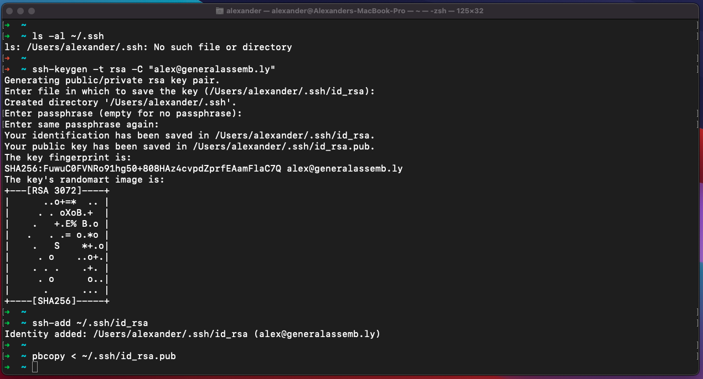
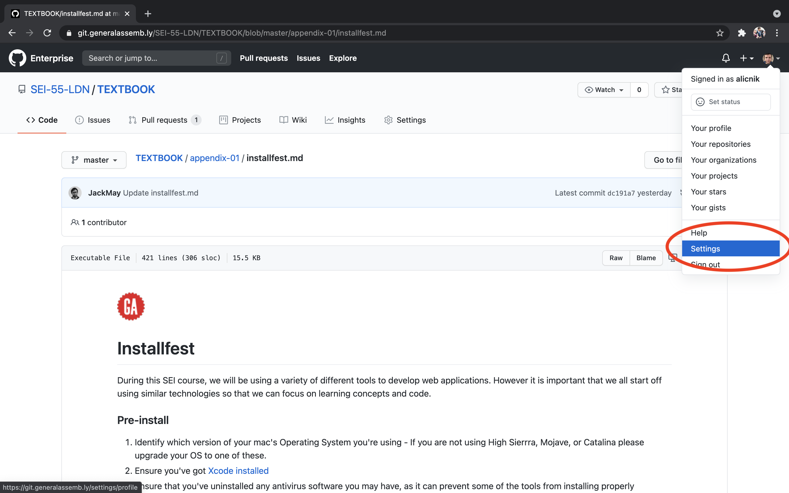
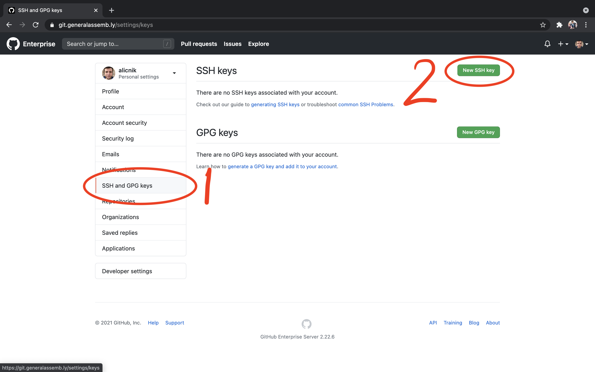
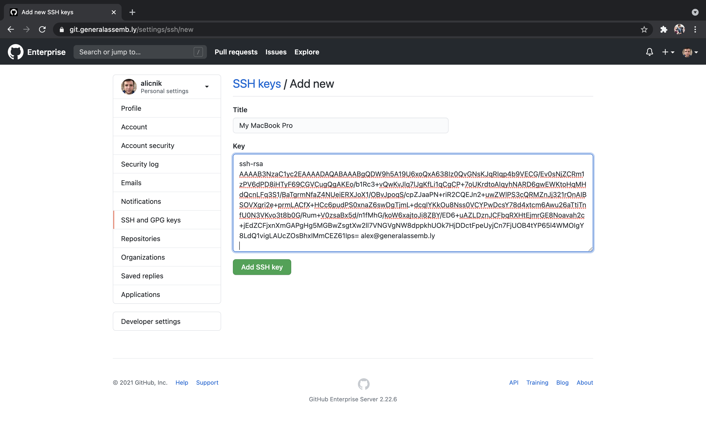

# Installfest

During this SEI course, we will be using a variety of different tools to develop web applications. However it is important that we all start off using similar technologies so that we can focus on learning concepts and code.

- [Installfest](#installfest)
  - [Pre-install](#pre-install)
- [Section 1: The Terminal](#section-1-the-terminal)
  - [Command Line Tools](#command-line-tools)
  - [Homebrew Package Manager](#homebrew-package-manager)
  - [Zsh](#zsh)
  - [Oh-My-Zsh](#oh-my-zsh)
- [Section 2: Git and Github setup](#section-2-git-and-github-setup)
  - [Install `git`](#install-git)
  - [Global `.gitignore`](#global-gitignore)
  - [Configure SSH access to Github](#configure-ssh-access-to-github)
- [Section 3: Node](#section-3-node)
  - [Install Node](#install-node)
- [Section 4: Code Editor and Linter setup](#section-4-code-editor-and-linter-setup)
  - [VSCode](#vscode)
  - [Eslint](#eslint)
- [Section 5: GUI applications](#section-5-gui-applications)
  - [Google Chrome](#google-chrome)
  - [Slack](#slack)
  - [Bear Notes](#bear-notes)
  - [Spectacle](#spectacle)
- [Closing Remarks](#closing-remarks)

<br>

## Pre-install

1. Identify which version of your mac's Operating System you're using - If you are not using Catalina or Big Sur please upgrade your OS to one of these.
2. Ensure that you've uninstalled any antivirus software you may have, as it can prevent some of the tools from installing properly

### \* _Please read all sections carefully and thoroughly, there is no need to rush with this task. Favour copying and pasting terminal commands for now as opposed to typing them. Be aware some commands have placeholders you will need to replace with your own information._ <!-- omit in toc -->

<br>

# Section 1: The Terminal

The Terminal is a Command Line Interface that allows you to interact directly with your laptop's operating system. You can use it to run programmes, manage files and folders, and install software. Because we'll be using it so much on the course, we'll start by upgrading the default terminal with some extra commands and features.

## Command Line Tools

Xcode is a large suite of software development tools and libraries from Apple. The Xcode Command Line Tools are part of XCode. Installation of many common Unix-based tools requires the [GCC compiler](https://en.wikipedia.org/wiki/GNU_Compiler_Collection). The Xcode Command Line Tools include a GCC compiler.

Open the Terminal by hitting <kbd>cmd</kbd> + <kbd>space</kbd>, then type Terminal and hit <kbd>enter</kbd>

1. At the terminal prompt enter: `xcode-select --install`.
2. Choose `Install` from the prompt then `agree` to the license agreement. The download will take a while...
3. If you receive a message saying `Can't install the software because it is not currently available from the Software Update server` it's probably because the command line tools are already installed. If so type `gcc` in the terminal. If you see `gcc: command not found` inform your instructor, otherwise, move on to the next step.
4. Type `sudo xcodebuild -license` and type in your password at the prompt.
5. Press enter, then `q`.
6. Then on the next prompt, type `agree`.

## Homebrew Package Manager

Homebrew is a package manager for OS X.

### What are packages?

Packages are bundles of source code distributed by developers of software, which can be compiled and installed on your machine.

### Installing Homebrew

1. Copy and paste the following command into the terminal, then hit enter

   ```sh
   /bin/bash -c "$(curl -fsSL https://raw.githubusercontent.com/Homebrew/install/HEAD/install.sh)"
   ```

2. Press `enter` at the prompt, and enter your password.
3. Once installation has finished type `brew doctor`. It should say `Your system is ready to brew.` If not inform one of your instructors.
4. Update Homebrew: `brew update`

## Zsh

### What is a shell?

We will go into a bit more detail about the shell later on in the course but a shell is a very basic user interface for accessing an operating system's services.

### zsh vs bash

Since Catalina, Macs have shipped with a shell called `zsh` by default. The American English pronunciation of Z is "zee", so Z-shell rhymes with C-shell, which sounds like seashell. `zsh` was also the login of the original developer Paul Falstad's Yale professor Zhong Shao.

Older versions of MacOS came with the `bash` shell. Bash stands for **'Bourne-again shell'**, referring to its objective as a free replacement for the Bourne shell which was developed by [Steven Bourne](https://en.wikipedia.org/wiki/Stephen_R._Bourne). We use `zsh` because it has some extra features that make web development easier.

Check you are using `zsh` by entering `echo $SHELL` in Terminal. You should see `/bin/zsh/` returned. If you don't, talk to one of the instructional team.

## Oh-My-Zsh

Oh My Zsh is an open source, community-driven framework for managing your zsh configuration. Here is the link to the [Github](https://github.com/robbyrussell/oh-my-zsh).

The `PATH` environment variable is a colon-delimited list of directories that your shell searches through when you enter a command. We'll also add some aliases, one of the great features of zsh which allow you to preconfigure shortcuts to run complex commands without having to type out the whole thing.

1. Copy and paste this into Terminal and press Enter: `sh -c "$(curl -fsSL https://raw.githubusercontent.com/robbyrussell/oh-my-zsh/master/tools/install.sh)"`.
2. Open the `.zshrc` file by typing `open ~/.zshrc`
3. Find the line `# export PATH=$HOME/bin:/usr/local/bin:$PATH` It's right at the top of the file.
4. Remove the `#` and the space at the start.
5. Scroll to the bottom of the page and paste in the following aliases:

   ```txt
   alias clearnode="rm -rf node_modules && rm -rf package-lock.json && rm -rf yarn.lock"

   alias resetnpm="rm -rf node_modules && rm -rf package-lock.json && rm -rf yarn.lock && npm i"

   alias resetyarn="rm -rf node_modules && rm -rf package-lock.json && rm -rf yarn.lock && yarn"
   ```

6. Save the file and quit the text editor.
7. Close your terminal and open a new one, you should notice a slightly different layout of the terminal application now with a green arrow at the command prompt.

<br>

# Section 2: Git and Github setup

## Install `git`

Git is the version control system that we will use throughout the course. It is one of the most powerful tools you will use as a developer.

1. In Terminal, enter:`brew install git`
2. Quit Terminal and reopen.
3. Configure your name and email address for commits (be sure to use the email address you have registered with Github):

   ```sh
   git config --global user.name "Your Name"
   git config --global user.email "you@example.com"
   ```

4. Configure git to track case changes in file names:

   ```sh
   git config --global core.ignorecase false
   ```

<br>

## Global `.gitignore`

There are a few files that we don't want Git to track. We can tell Git to ignore them everywhere by adding the files to a global `.gitignore` file. `.gitignore` and `.zshrc` are examples of dotfiles (by convention they start with a `.`), which you will come across a lot when dealing with configuration.

- `.DS_Store` files

  These dotfiles are used by Mac OS X to store folder specific metadata information. They are different for every mac, it means that they often cause conflicts in version controlled folders.

- `node_modules`, `bower_components` & `.sass-cache`

  In the same way, we want to never track the contents of our node_modules, bower_components or .sass-cache folder (a dotfile can be a directory, too!) as these are not part of our source code and do not need to be committed.

### Instructions

Create a file in your home directory called `.gitignore_global` and configure git to use it for all repos, like so:

```sh
touch ~/.gitignore_global
git config --global core.excludesfile ~/.gitignore_global
```

Open the `.gitignore_global` file:

```sh
open  ~/.gitignore_global
```

And add the following lines:

```txt
.DS_Store
node_modules
.sass-cache
.env
*.log
```

**Save** and close the file.

## Configure SSH access to Github

GitHub is a web-based Git repository hosting service. It allows us to keep a remote version of our version-controlled projects. When we push and pull from Git, we don't want to always have to login to verify who we are. Therefore, what we can do is generate and use something called an SSH key. SSH keys are a way to identify trusted computers, without involving passwords.

1. First, we need to check for existing SSH keys on your computer. Open up your Terminal and type: `ls -al ~/.ssh`. If you get `No such file or directory` go to
   the next step **Generate a new SSH key**, otherwise, go to step 5 **Add your SSH Key to Github**.
2. Generate a new SSH key by typing `ssh-keygen -t rsa -C "your_email@example.com"`
3. You'll be prompted for a file to save the key, and a passphrase. Press enter for both steps leaving both options blank (default name, and no passphrase).
4. Add your new key to the ssh-agent: `ssh-add ~/.ssh/id_rsa`
5. Copy your key to the clipboard with the terminal command: `pbcopy < ~/.ssh/id_rsa.pub`
6. Your terminal should look something like this:

   

7. Add your SSH key to GitHub by logging into Github then clicking on **Settings** in the dropdown menu underneath your avatar:

   

8. Click on **SSH and GPG keys** in the left-hand menu, then click on **New SSH Key**:

   

9. In the **Title** field put something that identifies your machine, like _Mike's MacBook Air_
10. In the **Key** field just hit <kbd>cmd</kbd> + <kbd>V</kbd> to paste the key that you created earlier - _do not add or remove and characters or whitespace to the key_
11. Finally, click **Add SSH Key**:

    

12. Check everything works in the terminal by typing: `ssh -T git@git.generalassemb.ly`\*

\* Note this last command will be `git@github.com` when setting up your personal GitHub

You should see the following message:

```sh
Hi mickyginger! You've successfully authenticated, but GitHub does not provide shell access.
```

<br>

# Section 3: Node

Node is a JavaScript engine that works on the server side. We can use it to create full stack web applications, command line tools and various other tools and packages.

## Install Node

We will install it via Homebrew which we instaled in section 1. Although we'll not be using it directly until week 4, we'll install it now, so that we can use it to install some linter packages written with node.

```sh
brew install node
```

If you type:

```sh
node --version
```

You should see the version number that you've installed. Something like or greater than:

```sh
v15.12.0
```

When you install `node`, you will get `npm` (Node Package Manager) as well, which allows you to install packages that can greatly improve your projects. There is another package manager called `yarn`, which has gained popularity. We'll use `npm` on the course.

Double check to make sure `npm` was correclty installed:

```sh
npm --version
```

And you should see something similar to:

```sh
7.6.3
```

If any of these commands do not work or the outputs look different please make a member of the instructional team aware.

<br>

# Section 4: Code Editor and Linter setup

## VSCode

So far, we've used the default text editor, TextEdit. However, this will only get you so far and would make for a very painful Developer Experience if this was all you used! During the course we'll be using Microsoft's VSCode. It's similar in many ways to Sublime Text or Atom, but it has a nice user interface and a lot of 3rd-party plugins and packages that we can use to help us code more efficiently, and hopefully make fewer typos along the way. It is also widely used in the engineering and development communities.

### Installing VSCode

1. Download [VSCode](https://code.visualstudio.com/). You should automatically see the option 'Download Mac Universal', if not please select the macOS stable version.
2. Drag it into your `Applications` folder and add it to your dock. **This is an important step, ensure VSCode is now inside your applications folder**
3. Open VSCode, it should open to a 'Welcome' page, to stop this showing everytime, unselect 'Show welcome page' on startup in the bottom right hand corner.
4. Press <kbd>cmd</kbd> + <kbd>shift</kbd> + <kbd>p</kbd> to open the VSCode command pallete, we can install some handy shortcuts here:
   - In the command pallete input prompt box type 'shell command' and select the option `Shell Command: Install 'code' command in PATH`, this will allow us to open files and folders with VSCode directly from the terminal!
5. Press <kbd>cmd</kbd> + <kbd>,</kbd> to bring up your VSCode settings.
   - In the top search bar, start typing `tab`, You should see the option `Editor: Tab Size`, please set this to '2'.
   - Search for `detect indentation` and you will see an option `Editor: Detect Indentation`, please **uncheck** this box.
   - Search for 'minimap' and find the option 'Editor > Minimap: Enabled' and **uncheck** this box.
   - Search for 'explorer compact' and find the option 'Explorer: Compact Folders' and **uncheck** this box.
6. We will now install some extensions for VSCode, in your terminal please paste the following lines one at a time and press enter.

   ```sh
     code --install-extension file-icons.file-icons
     code --install-extension dbaeumer.vscode-eslint
     code --install-extension ms-python.python
     code --install-extension miramac.vscode-exec-node
     code --install-extension oderwat.indent-rainbow
     code --install-extension coenraads.bracket-pair-colorizer
     code --install-extension aaron-bond.better-comments
     code --install-extension ritwickdey.liveserver
     code --install-extension bierner.markdown-preview-github-styles
   ```

7. In the top bar please select `code` > `preferences` > `File Icon Theme` and select `File Icons` from the available list. (Restart may be required to see change make effect)
8. Now quit VSCode, <kbd>cmd</kbd> + <kbd>q</kbd>.

## Eslint

Eslint is a package designed to check for bugs in our code **before** we run it. VSCode has a package called a linter that we can configure to work with eslint to check our code _as we type_.

### 1. Install `eslint` packages

Install the following eslint packages globally with yarn:

```sh
npm i -g eslint@^5 eslint-plugin-react babel-eslint
```

### 2. Create an `.eslintrc` file

We're going to define a set of rules for `eslint` to use. From the terminal, run the following command:

```sh
code ~/.eslintrc
```

Copy and paste the following text into the file you just opened in VSCode:

```json
{
  "env": {
    "browser": true,
    "commonjs": true,
    "es6": true,
    "node": true
  },
  "plugins": ["react"],
  "extends": ["eslint:recommended", "plugin:react/recommended"],
  "parser": "babel-eslint",
  "parserOptions": {
    "sourceType": "module",
    "ecmaVersion": 7,
    "ecmaFeatures": {
      "jsx": true
    }
  },
  "rules": {
    "brace-style": "error",
    "camelcase": ["error", { "properties": "never" }],
    "func-call-spacing": ["error", "never"],
    "keyword-spacing": ["error", { "before": true }],
    "space-infix-ops": ["error", { "int32Hint": false }],
    "object-curly-spacing": ["error", "always"],
    "eqeqeq": "warn",
    "indent": ["error", 2, { "SwitchCase": 1 }],
    "key-spacing": ["error", { "beforeColon": false }],
    "no-console": "off",
    "no-fallthrough": "warn",
    "prefer-const": "error",
    "quotes": ["error", "single"],
    "semi": ["error", "never"],
    "comma-dangle": [
      "error",
      {
        "arrays": "never",
        "objects": "always-multiline",
        "imports": "never",
        "exports": "never",
        "functions": "never"
      }
    ],
    "react/prop-types": [0]
  }
}
```

And now **save the file** with <kbd>cmd</kbd> + <kbd>S</kbd>. You may see an error notification pop up when saving in VSCode, do not worry about this we will fix it shortly.

<br>

# Section 5: GUI applications

Finally we need to install some more traditional Graphical User Interface applications to help us throughout the course.

## Google Chrome

We primarily use Chrome on this course. If you use other browsers, you can continue to do so in your spare time. However, on this course all lessons will expect you to be using Chrome.

1. Go to [https://google.com/chrome](https://google.com/chrome)
2. Click on `Download Chrome`
3. Go to the Downloads folder and run the `googlechrome.dmg` package
4. Drag the icon into the Applications folder
5. Add Chrome to your dock and open it
6. Select `set Chrome as my default browser`

## Slack

Slack has a native app available on the App store. If you haven't already, [sign up to Slack](https://www.slack.com/) online, and install the OS app.

Once it has downloaded you'll find it your the Applications folder. Drag it into the dock and launch the app.

## Bear Notes

Great for organising and writing your notes. Even better it has support for code snippets to help make your notes very clear and readable.

[Get it Here](https://bear.app/)

## Spectacle

A great app for organsing your windows on Mac.

[Get it Here](https://www.spectacleapp.com/)

# Closing Remarks

Don't worry, you won't have to remember how to do all of this. If you need to setup a new machine in the future, we can send you over these installation instructions!
